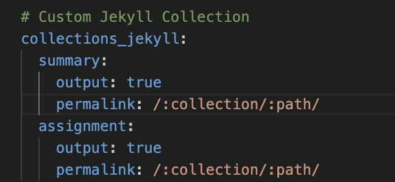
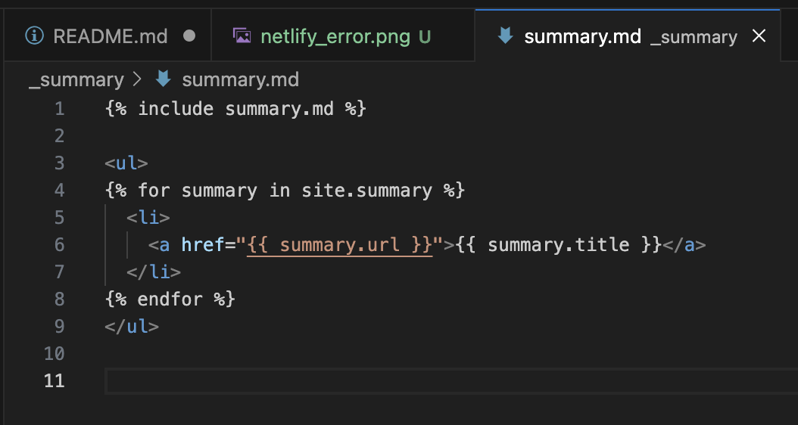
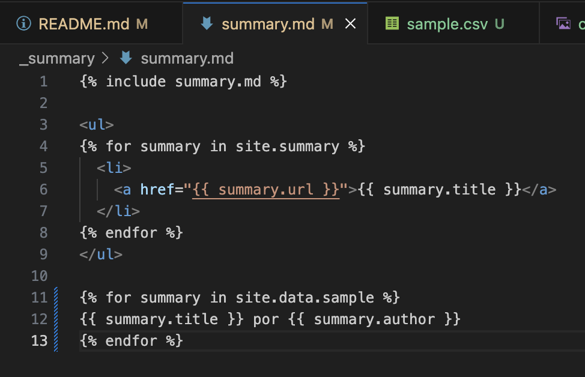
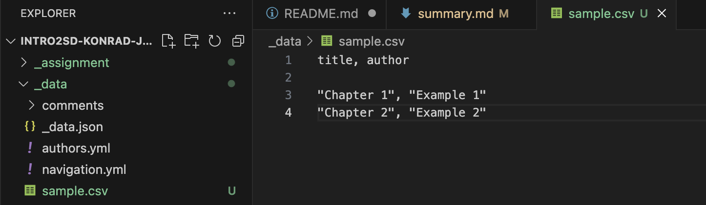
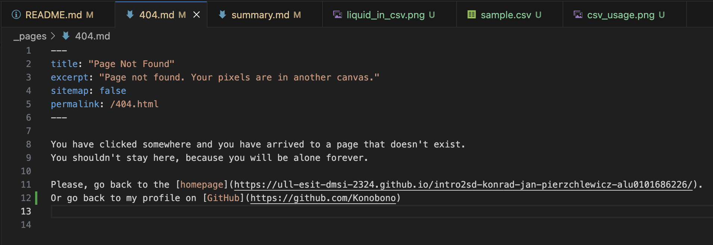

# Systems Development Overview: A Practice Using Jekyll and GitHub Pages

## Description

This project includes a summary of the topics that we learned at the classes, alongside a deployed website using Jekyll and GitHub Pages.

## Table of Contents

- [Summary of the first chapter](#Summary-of-the-first-chapter)
- [Deployment in Jekyll and GitHub Pages](#deployment-in-jekyll-and-github-pages)
- [Deployment in Netlify](#deployment-in-netlify)
- [Personalized 404 page](#personalized-404-page)
- [Kanban Board](#kanban-board)
- [Jekyll Collection](#jekyll-collection)
- [Usage of Jekyll and Data types](#usage-of-jekyll-and-data-types)
- [Usage of the `.csv` or `.json` file types in _data folder](#usage-of-the-csv-or-json-file-types-in-_data-folder)
- [Configuration of `_config.yml`](#configuration-of-_configyml)
- [Delivery of `.zip` file](#delivery)

## Rubric for the project

- [x] **The website has been deployed to GitHub pages using Jekyll**
- [x] **Correct summary of the topic**
- [x] **Kanban Board project contains the incidents of the rubric**
- [x] **Desployment in Netlify**
- [x] **Creation of Jekyll Collection**
- [x] **Usage of Liquid**
- [x] **Usage of `.csv` or `.json` files types in `_data` folder**
- [x] **Configuration of `_config.yml`**
- [x] **Personalized 404 page**
- [x] **Personal page on GitHub Pages**
- [x] **Personal page on GitHub Pages linked from the student's GitHub profile**
- [x] **Delivery of the `.zip` on campus with the repository**

## Summary of the first chapter

The summary of the first chapter is avaiable in the `_summary` folder or at the `/summary` directory at the website.

## Deployment in Jekyll and GitHub Pages

The website has been deployed using Jekyll and is available on GitHub Pages. See the `_config.yml` file for configuration.

## Deployment in Netlify

Doesn't work for me, permission issue.

## Personalized 404 page

Personalized the 404 error page at the URL `/404.html`.

## Kanban Board

Created a Kanban Board for the project using GitHub Projects. See the `Projects` tab on the repository.

## Jekyll Collection

Configured a Jekyll Collection for the project in `_assignment` folder. See the `_config.yml` file for configuration.

  

## Usage of Liquid and data types

Liquid tags used to work in certain files, for example in `summary.md` file to include the summary of the topics using `_includes`.

  
    

## Usage of `.csv` or `.json` file types in `_data` folder

Usage of other file types in `_data` folder, for example the `.csv` file used in the screenshot below.

  

## Configuration of `_config.yml`

Adjusted the `_config.yml` file to include the Jekyll Collection and the Liquid tags.

## Link to GitHub profile on personalized GitHub page

The link to my GitHub profile is available on the website at the `/404.html` page.

  

## Delivery of `.zip` file

Delivered the `zip` file on campus with the repository.

---

Final check if everything is okay